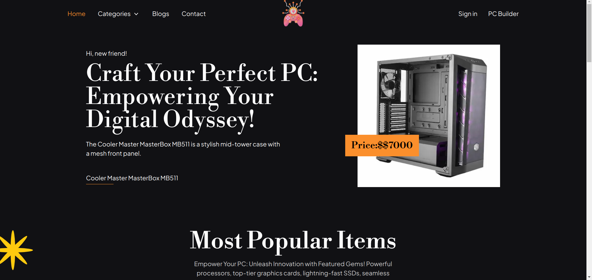

### PC Builder Website



[Visit the PC Builder Website](https://ah-pc-builder.vercel.app/)

## Description

Welcome to the PC Builder Website, your ultimate destination for exploring a
wide range of PC-related products and building your dream custom PC
configurations. Whether you're a gaming enthusiast, a content creator, or simply
in need of a powerful workstation, this platform provides an intuitive and
user-friendly experience to find the perfect components for your PC build.

## Features

- **Explore a Variety of Products:** Browse through an extensive collection of
  PC components, peripherals, and accessories, including CPUs, GPUs,
  motherboards, memory, storage, monitors, and more.

- **Detailed Product Information:** Get in-depth details about each product,
  including specifications, features, customer reviews, and expert ratings, to
  make well-informed decisions.

- **Custom PC Builder:** Create your personalized PC configuration by choosing
  items from different categories. See real-time price updates and total cost as
  you build.

- **Seamless User Experience:** Enjoy a smooth and responsive user interface,
  designed to make your journey in building your ideal PC enjoyable and
  hassle-free.

- **Popup and Download Options:** Upon completing your PC build, easily access a
  popup displaying your configuration details and download options for future
  reference.

## Technologies Used

- Next.js
- MongoDB
- React
- TypeScript
- Tailwind
- Tailwind HeadlessUi
- Farmer motion

## Getting Started

### Prerequisites

- Node.js and npm installed on your machine.
- MongoDB server up and running.

### Installation

1. **Clone the repository:**

      ```bash
      git clone https://github.com/your-username/pc-builder-website.git
      cd pc-builder-website
      ```

2. **Run project in vs code**

      ```bash
      cd pc-builder-website

       yarn or npm install

      ```

3. **ENV setup:**

      ```bash
      MONGODB_URI=your-mongodb-connection-string
      BASE_URL=your-api-base-url
      GITHUB_ID=your-github-id
      GITHUB_SECRET=your-github-secret-key
      NEXTAUTH_SECRET=your-nextauth-secret-key

      ```

4. **Run project in dev:**

      ```bash
      npm run dev  or yarn dev

       <!-- Open your browser and visit http://localhost:3000 to access the website. -->
      ```

## API Endpoints

The following API endpoints are available:

- **GET /api/products:** Fetch all products
- **GET /api/products/featured:** Fetch all featured products
- **GET /api/products/<"product id">** Fetch product details by ID
- **GET /api/categories:** Fetch all categories
- **GET /api/categories/<"category key">** Fetch category details by category
  key
- **GET /api/categories/products** Fetch products by category
- **POST /api/[...nextauth]:** For authentication by Next AUth

## Contact and Support

Thank you for visiting the PC Builder Website! If you have any questions,
feedback, or need assistance, feel free to reach out to me:

- Email: ahsanullahsunsbd@gamil.com
- Twitter: [@ahsanullah1871](https://twitter.com/ahsanullah1871)
- facebook:
  [https://www.facebook.com/Ahsan1871/](https://www.facebook.com/Ahsan1871/)
- Website: [www.pc-builder-website.com](https://www.pc-builder-website.com)

## Happy Building!

I hope you enjoy using the PC Builder Website to create your perfect PC setup.
Whether you're a seasoned PC enthusiast or new to building computers, my goal is
to provide you with a seamless experience. If you encounter any issues or have
suggestions for improvement, please let us know. Happy building!

